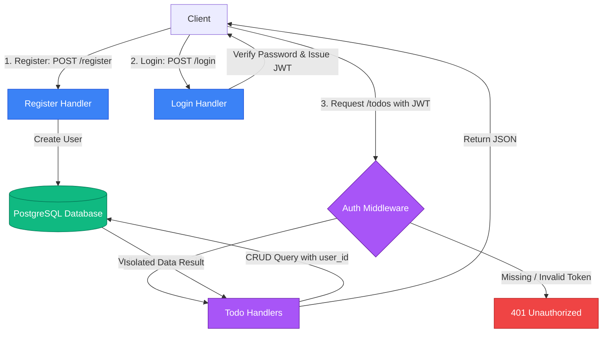

# Todo REST API with JWT Authentication

A secure, multi-user Todo REST API built in Go using the **Gin** web framework, **PostgreSQL** for persistence, **pgx** for connection pooling, and **Docker Compose** for automated local stack deployments.

---

## Architecture Flow

The flowchart below visualizes the user authentication cycle and how requests are processed through the authentication middleware to enforce user data isolation.



---

## Features

- **JWT Authentication**: Secure user registration and login issuing signed JSON Web Tokens.
- **User Data Isolation**: Every todo item is strictly tied to a `user_id`. Users can only create, view, update, or delete their own tasks.
- **Automated Database Migrations**: Seamless schema setup using `migrate/migrate` running automatically during container initialization.
- **CORS Enabled**: Configured cross-origin resource sharing middleware for frontend flexibility.
- **Hot Reload**: Integrated `.air.toml` configuration for rapid local testing and development.

---

## Tech Stack

- **Backend**: Go (Golang)
- **Web Framework**: Gin
- **Database**: PostgreSQL (via pgx pool connection)
- **Authentication**: JWT (`golang-jwt/jwt/v5`) & Bcrypt (`golang.org/x/crypto/bcrypt`)
- **Containerization**: Docker & Docker Compose

---

## API Endpoints Reference

| Method | Endpoint | Description | Authentication |
| :--- | :--- | :--- | :--- |
| **POST** | `/register` | Create a new user account | Public |
| **POST** | `/login` | Authenticate credentials and get JWT token | Public |
| **GET** | `/` | API Healthcheck status | Public |
| **GET** | `/todos` | Retrieve all todo items belonging to the user | Required (Bearer Token) |
| **POST** | `/todos` | Create a new todo item | Required (Bearer Token) |
| **GET** | `/todos/:id` | Fetch a specific todo item by ID | Required (Bearer Token) |
| **PUT** | `/todos/:id` | Update a todo's title or completion status | Required (Bearer Token) |
| **DELETE** | `/todos/:id`| Delete a todo item by ID | Required (Bearer Token) |

---

## Getting Started

### Prerequisites

Ensure you have [Docker](https://www.docker.com/) and Docker Compose installed on your system.

### Running the Project

1. Clone the repository and navigate into the directory.
2. Spin up the containers (database, migrations running container, and backend application):
   ```bash
   docker-compose up --build
   ```
3. The server starts on port `8081`. You can access the health status of the API at [http://localhost:8081/](http://localhost:8081/).

### Testing Flow

#### 1. Register a User
```powershell
$res = Invoke-RestMethod -Uri http://localhost:8081/register -Method Post -Body '{"username":"alice","password":"password123"}' -ContentType "application/json"
$res
```

#### 2. Log in and retrieve the JWT token
```powershell
$login = Invoke-RestMethod -Uri http://localhost:8081/login -Method Post -Body '{"username":"alice","password":"password123"}' -ContentType "application/json"
$token = $login.token
```

#### 3. Test Authorized Request (Creating a Todo)
```powershell
$headers = @{ Authorization = "Bearer $token" }
Invoke-RestMethod -Uri http://localhost:8081/todos -Method Post -Body '{"title":"Implement Auth","completed":false}' -ContentType "application/json" -Headers $headers
```

#### 4. Query User's Todos
```powershell
Invoke-RestMethod -Uri http://localhost:8081/todos -Method Get -Headers $headers
```
